<h1 align="center">
  Dendoink
   
  a dreamer who looks up at the stars
</h1>

  <em>"I'm a dreamer, like the man who looks up at the stars and believes in possibilities beyond the ordinary."</em>
   
  — The Matrix

  
  
  

 

<!-- Contribution snake — generated daily by .github/workflows/snake.yml -->
<picture>
  <source media="(prefers-color-scheme: dark)" srcset="https://raw.githubusercontent.com/dendoink/dendoink/output/github-snake-dark.svg"/>
  <source media="(prefers-color-scheme: light)" srcset="https://raw.githubusercontent.com/dendoink/dendoink/output/github-snake.svg"/>
  
</picture>

 
 

<!-- Stats row — anuraghazra/github-readme-stats public endpoint -->

  
  

  

 

<!-- Deep metrics — generated daily by .github/workflows/metrics.yml -->

  

